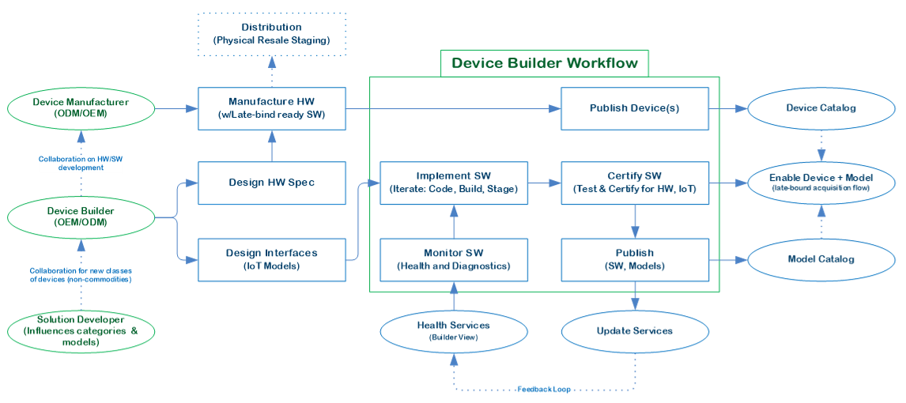

# Builders, developers, and operators

*Device builders*, *application developers*, and *solution operators* are the typical roles surrounding the ongoing development, monitoring, and maintenance of an internet-of-things (IoT) solution throughout its lifecycle. This article provides an overview of these three roles.

Device builders create the device hardware and software that interact with applications. Application developers develop the software that makes up IoT applications. Solution operators run and monitor the IoT solutions.

Different companies, organizations, or individuals may fill these roles, or the same individuals may take on different roles during the IoT solution lifecycle. While many other roles can exist around IoT solutions, these three roles provide helpful perspectives for viewing an IoT solution during its design, development, and deployment.

## Device builder

The IoT device builder is usually an Original Device Manufacturer (ODM) or Original Equipment Manufacturer (OEM). The builder may build IoT-compatible devices for specific solutions or for sets of solutions made by Independent Software Vendors (ISVs) or System Integrators (SIs). It's common for device builders and application developers to work closely together in developing devices tailored to solutions.

In addition to providing devices and their *firmware*, or built-in software, the device builder is responsible for publishing device updates to address bugs and security patches and enable additional capabilities. Device builders can use Content Delivery Networks (CDNs) to publish device updates, or design solutions that can programmatically consume updates on behalf of devices.

Devices for an IoT solution should have:

- Appropriate security for target solutions. For more information about secure device characteristics, see [The Seven Properties of Highly Secure Devices](https://www.microsoft.com/research/publication/seven-properties-highly-secure-devices/).
- Fault-tolerant device update mechanisms that let devices keep functioning on failed or interrupted updates.
- Update mechanisms that separate update publishing from update deployment, so solution operators can control update deployment to devices in the field.
- Device builder access to monitoring and diagnostics data to monitor, identify, and remediate device issues.
- Clear expectations for how long to support device software versions and how to replace devices in the field.

## Application developer

IoT application developers can be ISVs, SIs, or organizations. Application developers might collaborate closely with device builders on new device categories, and with solution operators to ensure adequate solution monitoring and maintenance.

Just as device builders provide updates to devices in the field, application developers provide application updates to fix issues, add new features, and improve stability and performance.

IoT applications should have:
- Upgrade mechanisms that minimize customer impact to key scenarios.
- Built-in live monitoring and insights that include issue detection and diagnosis, alerting, and remediation.
- The ability to absorb future scale and traffic demands as device and user populations grow.

## Solution operator

IoT solution operators manage IoT solutions throughout their lifecycles. The solution operator and solution developer workflows for cloud applications might overlap.

Deploying updates to IoT devices can be complex, because updates might need orchestration with applications to ensure they happen when appropriate. If the device builder update workflow is highly decoupled from the cloud application, it's best to design a workflow that distributes device updates through the cloud application.

An IoT solution operator workflow should:

- Let the device builder access device health and diagnostics data to identify and create device software updates.
- Let the operator access device software updates through automated or manual interaction with a repository or CDN.
- Be able to selectively distribute updates based on policies the operator sets.
- Account for device management through updating and replacing devices.

## Related resources

- [Overview of device management with IoT Hub](/azure/iot-hub/iot-hub-device-management-overview)
- [Streamlined IoT device certification with Azure IoT certification service](https://azure.microsoft.com/blog/streamlined-iot-device-certification-with-azure-iot-certification-service/)
- [Azure DevOps integration](https://azure.microsoft.com/product-categories/devops/)