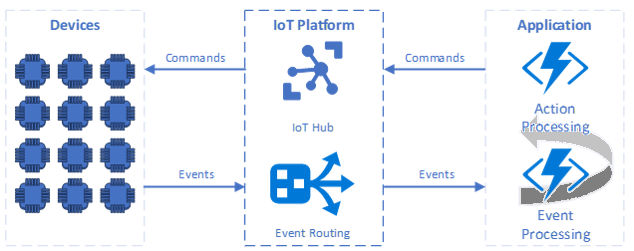

# IoT solution architecture

Topologically, Azure Internet-of-Things (IoT) solutions are a collection of assets and components divided across *IoT devices*, the *IoT platform*, and *IoT applications*. [Events, insights, and actions](introduction-to-solutions.md) are data flow and processing pipelines that occur across these structural parts.

This article describes IoT device, platform, and application characteristics. The article also discusses IoT Edge gateways, and IoT platform attestation, authentication, protocols, and provisioning.

## IoT devices, platform, and applications

*IoT devices* are the physical or virtual things that send events to and receive commands from IoT applications. The terms *thing* and *device* both mean a connected device in an IoT solution.

An IoT device has one or more of the following characteristics:
- Possesses a unique *identity* that distinguishes it within the solution.
- Has *properties*, or a *state*, that applications can access.
- Sends *events* to the IoT platform for applications to act on.
- Receives *commands* from applications to execute.

The *IoT platform* is the collection of services that allow devices and applications to connect and communicate with each other. The Azure IoT platform usually consists of [Azure IoT Hub](/azure/iot-hub/about-iot-hub) and event routing services like [Azure Event Hub](/azure/iot-hub/iot-hub-compare-event-hubs).

The IoT platform at least:
- Brokers secure *connectivity*, *authentication*, and *communication* between devices and trusted applications.
- Generates *contextual insights* on incoming events to determine the routing of events to endpoints.

*Applications* are the collection of scenario-specific services and components that are unique to an IoT solution. IoT applications typically have:
- A mix of Azure or other services for compute, storage, and event endpoints, combined with unique application business logic.
- *Event* workflows to receive and process incoming device events.
- *Action* workflows to send commands to devices or other processes.

## See also
- [IoT application-to-device commands](cloud-to-device.md)