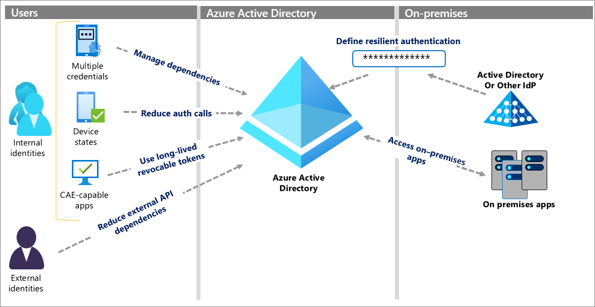

# Resilient identity and access management with Azure AD

Identity and access management (IAM) is the process, policy, and technology framework that covers management of identities and what they can access. IAM includes components that support authentication and authorization of user and other accounts in a system.

Any component of an IAM system can cause disruption. IAM resilience is the ability to endure disruption to IAM system components and recover with minimal impact to business, users, customers, and operations. This guide describes ways to build a resilient IAM system.

To promote IAM resilience:

- Assume disruptions will occur, and plan for them.
- Reduce dependencies, complexity, and single points of failure.
- Ensure comprehensive error handling.

Recognizing and planning for contingencies is important. However, adding more identity systems, with their dependencies and complexity, could reduce rather than increase resilience.

Developers can help manage IAM resilience in their applications by using [Azure AD Managed Identities](/azure/active-directory/managed-identities-azure-resources/overview) wherever possible. For more information, see [Increase resilience of authentication and authorization applications you develop](/azure/active-directory/fundamentals/resilience-app-development-overview).

When planning for resilience of an IAM solution, consider the following elements:

- The applications that rely on your IAM system.
- The public infrastructures that your authentication calls use, including:
  - Telecom companies.
  - Internet service providers.
  - Public key providers.
- Your cloud and on-premises identity providers.
- Other services that rely on your IAM, and APIs that connect the services.
- Any other on-premises components in your system.

## Architecture

This diagram shows several ways to increase IAM resilience. The linked articles explain the methods in detail.

### Manage dependencies and reduce authentication calls

Every authentication call is subject to disruption if any component of the call fails. When authentication is disrupted because of underlying component failures, users can't access their applications. So, reducing the number of authentication calls and the number of dependencies in those calls is essential for resilience.

- Manage dependencies. [Build resilience with credential management](/azure/active-directory/fundamentals/resilience-in-credentials).
- Reduce authentication calls. [Build resilience with device states](/azure/active-directory/fundamentals/resilience-with-device-states).
- Reduce external API dependencies.

### Use long-lived revocable tokens

In a token-based authentication system like Azure AD, a user's client application must acquire a security token from the identity system before it can access an application or other resource. During the token validity period, the client can present the same token multiple times to access the application.

If the validity period expires during the user's session, the application rejects the token, and the client must acquire a new token from Azure AD. Acquiring a new token potentially requires user interaction like credential prompts or other requirements. Reducing the authentication call frequency with longer-lived tokens decreases unnecessary interactions. However, you must balance token life with the risk created by fewer policy evaluations.

- Use long-lived revocable tokens.
- [Build resilience by using Continuous Access Evaluation (CAE)](/azure/active-directory/fundamentals/resilience-with-continuous-access-evaluation).

For more information on managing token lifetimes, see [Optimize reauthentication prompts and understand session lifetime for Azure AD Multi-Factor Authentication](/azure/active-directory/authentication/concepts-azure-multi-factor-authentication-prompts-session-lifetime).

### Hybrid and on-premises resilience

- [Build resilience in your hybrid architecture](/azure/active-directory/fundamentals/resilience-in-hybrid) to define resilient authentication from on-premises Active Directory or other identity providers (IdPs).
- To manage External Identities, [build resilience in external user authentication](/azure/active-directory/fundamentals/resilience-b2b-authentication).
- For accessing on-premises apps, [build resilience in application access with Application Proxy](/azure/active-directory/fundamentals/resilience-on-premises-access).

## Next steps

- [Integrate on-premises AD domains with Azure AD](/azure/architecture/reference-architectures/identity/azure-ad)
- [Hybrid identity](/azure/architecture/solution-ideas/articles/hybrid-identity)
- [Manage identity in multitenant applications](/azure/architecture/multitenant-identity)
- [Build resilience in your IAM infrastructure](/azure/active-directory/fundamentals/resilience-in-infrastructure)
- [Build resilience in your customer facing applications (CIAM) systems with Azure Active Directory B2C](/azure/active-directory/fundamentals/resilience-b2c)
