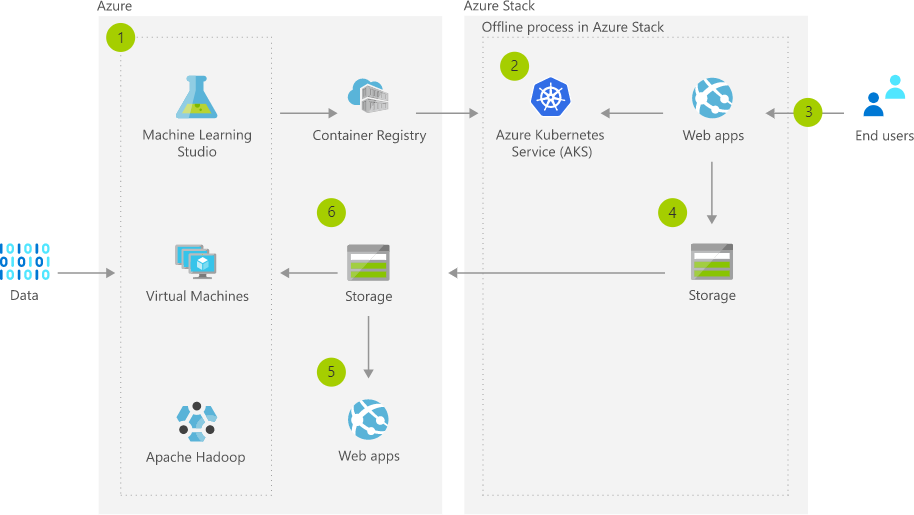

[!INCLUDE [header_file](../../../includes/sol-idea-header.md)]

With the Azure AI tools and cloud platform, the next generation of AI-enabled hybrid applications can run where your data lives. With Azure Stack Hub, bring a trained AI model to the edge and integrate it with your applications for low-latency intelligence, with no tool or process changes for local applications. With Azure Stack Hub, you can ensure that your cloud solutions work even when disconnected from the internet.

## Architecture

*Download an [SVG](../media/ai-at-the-edge-disconnected.svg) of this architecture.*

## Data Flow

1. Data scientists train a model using Azure Machine Learning Studio (classic) and an HDInsight cluster. The model is containerized and put in to an Azure Container Registry.
1. The model is deployed via steps not represented in the diagram to a Kubernetes cluster on Azure Stack Hub.
1. End users provide data that is scored against the model.
1. Insights and anomalies from scoring are placed into storage for later upload.
1. Globally-relevant and compliant insights are available in the global app.
1. Data from edge scoring is used to improve the model.

## Components

* [HDInsight](https://azure.microsoft.com/services/hdinsight): Provision cloud Hadoop, Spark, R Server, HBase, and Storm clusters
* [Azure Machine Learning Studio (classic)](/azure/machine-learning/studio): Easily build, deploy, and manage predictive analytics solutions
* [Virtual Machines](https://azure.microsoft.com/services/virtual-machines): Provision Windows and Linux virtual machines in seconds
* [Azure Kubernetes Service (AKS)](https://azure.microsoft.com/services/kubernetes-service): Simplify the deployment, management, and operations of Kubernetes
* [Storage](https://azure.microsoft.com/services/storage): Durable, highly available, and massively scalable cloud storage
* [Azure Stack Hub](https://azure.microsoft.com/overview/azure-stack): Build and run innovative hybrid applications across cloud boundaries

## Next steps

* [HDInsight documentation](/azure/hdinsight)
* [Azure Machine Learning Studio (classic) documentation](/azure/machine-learning/studio)
* [Virtual Machines documentation](/azure/virtual-machines/workloads/sap/get-started?toc=%2fazure%2fvirtual-machines%2fwindows%2fclassic%2ftoc.json)
* [Azure Kubernetes Service (AKS) documentation](/azure/aks)
* [Storage documentation](/azure/storage)
* [Azure Stack Hub documentation](/azure/azure-stack/user/azure-stack-solution-machine-learning)
