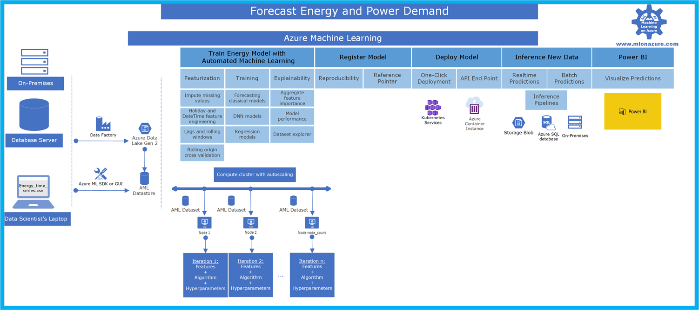

[!INCLUDE [header_file](../../../includes/sol-idea-header.md)]

Learn how Microsoft Azure can help accurately forecast spikes in demand for energy products and services to give your company a competitive advantage.

This solution is built on the Azure managed services: [Azure Stream Analytics](https://azure.microsoft.com/services/stream-analytics), [Event Hubs](https://azure.microsoft.com/services/event-hubs), [Azure Machine Learning](https://azure.microsoft.com/services/machine-learning), [Azure SQL Database](https://azure.microsoft.com/services/sql-database), [Data Factory](https://azure.microsoft.com/services/data-factory) and [Power BI](https://powerbi.microsoft.com). These services run in a high-availability environment, patched and supported, allowing you to focus on your solution instead of the environment they run in.

## Architecture

*Download an [SVG](../media/forecast-energy-power-demand.svg) of this architecture.*

## Components

* [Azure Stream Analytics](https://azure.microsoft.com/services/stream-analytics): Stream Analytics aggregates energy consumption data in near real-time to write to Power BI.
* [Event Hubs](https://azure.microsoft.com/services/event-hubs) ingests raw energy consumption data and passes it on to Stream Analytics.
* [Azure Machine Learning](https://azure.microsoft.com/services/machine-learning): Machine Learning forecasts the energy demand of a particular region given the inputs received.
* [Azure SQL Database](https://azure.microsoft.com/services/sql-database): SQL Database stores the prediction results received from Azure Machine Learning. These results are then consumed in the Power BI dashboard.
* [Data Factory](https://azure.microsoft.com/services/data-factory) handles orchestration and scheduling of the hourly model retraining.
* [Power BI](https://powerbi.microsoft.com) visualizes energy consumption data from Stream Analytics as well as predicted energy demand from SQL Database.

## Next steps

* [Learn more about Stream Analytics](/azure/stream-analytics/stream-analytics-introduction)
* [Learn more about Event Hubs](/azure/event-hubs/event-hubs-what-is-event-hubs)
* [Learn more about Azure Machine Learning](/azure/machine-learning/overview-what-is-azure-ml)
* [Learn more about SQL Database](/azure/sql-database)
* [Learn more about Data Factory](/azure/data-factory/data-factory-introduction)
* [Learn more about Power BI](https://powerbi.microsoft.com/documentation/powerbi-landing-page)